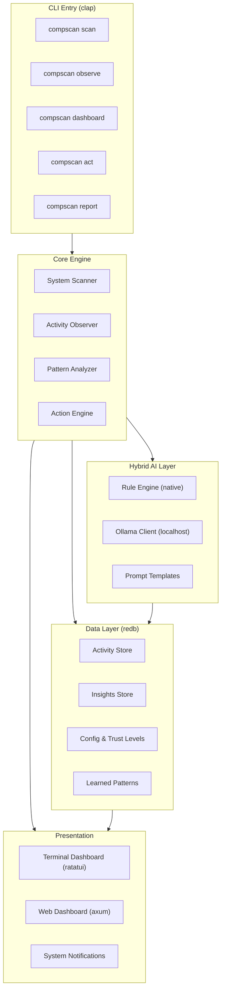
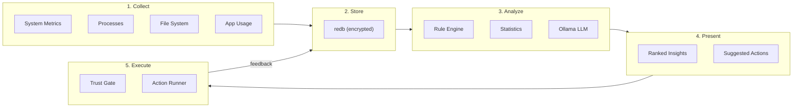
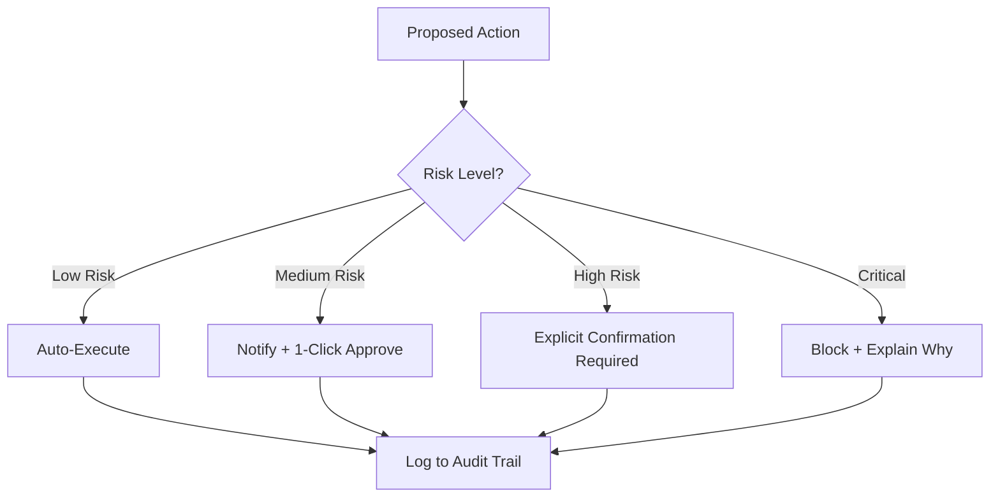

# CompScan — Local AI Life & Workflow Agent

## Architecture Overview




## Technology Stack

- **Language:** Rust (2021 edition)
- **CLI:** `clap` v4 with derive macros
- **System Info:** `sysinfo` v0.38 (cross-platform: macOS, Linux, Windows)
- **Database:** `redb` v2 (ACID, stable 1.0+, pure Rust)
- **TUI:** `ratatui` v0.30 + `crossterm`
- **Web:** `axum` v0.8 + embedded HTML/JS (no separate frontend build)
- **AI/LLM:** `ollama-rest` v0.7 (Ollama REST client)
- **Async:** `tokio` (multi-threaded runtime)
- **Serialization:** `serde` + `serde_json`
- **Encryption:** `aes-gcm` + `argon2` (data-at-rest encryption)
- **Filesystem:** `walkdir`, `notify` (file watcher)
- **Logging:** `tracing` + `tracing-subscriber`
- **Time:** `chrono`

## Project Structure

```
comp-scan/
├── Cargo.toml
├── README.md
├── src/
│   ├── main.rs                    # Entry point, CLI dispatch
│   ├── lib.rs                     # Public API surface
│   │
│   ├── cli/
│   │   └── mod.rs                 # Clap command definitions
│   │
│   ├── scanner/
│   │   ├── mod.rs                 # Scanner orchestrator
│   │   ├── system.rs              # CPU, RAM, disk, network
│   │   ├── processes.rs           # Process tracking
│   │   ├── filesystem.rs          # Disk analysis, large files
│   │   ├── startup.rs             # Startup items (platform-specific)
│   │   └── security.rs            # Security audit
│   │
│   ├── observer/
│   │   ├── mod.rs                 # Observer daemon loop
│   │   ├── activity.rs            # Active app/window tracking
│   │   ├── patterns.rs            # Usage pattern detection
│   │   ├── coding.rs              # Git, IDE, build tracking
│   │   └── habits.rs              # Focus time, breaks, screentime
│   │
│   ├── analyzer/
│   │   ├── mod.rs                 # Analysis pipeline
│   │   ├── rules.rs               # Rule-based engine (100+ rules)
│   │   ├── statistics.rs          # Statistical anomaly detection
│   │   └── insights.rs            # Insight generation & ranking
│   │
│   ├── ai/
│   │   ├── mod.rs                 # AI orchestrator (hybrid routing)
│   │   ├── ollama.rs              # Ollama client wrapper
│   │   ├── prompts.rs             # Prompt templates
│   │   └── reasoning.rs           # Complex reasoning pipeline
│   │
│   ├── actions/
│   │   ├── mod.rs                 # Action registry
│   │   ├── executor.rs            # Sandboxed action runner
│   │   ├── permissions.rs         # Trust-level permission gate
│   │   ├── cleanup.rs             # Cache/temp/log cleanup
│   │   ├── optimization.rs        # System optimization actions
│   │   └── workflow.rs            # Workflow improvement actions
│   │
│   ├── storage/
│   │   ├── mod.rs                 # Storage facade
│   │   ├── db.rs                  # redb setup & tables
│   │   ├── models.rs              # Data models (Activity, Insight, etc.)
│   │   └── encryption.rs          # AES-GCM encryption layer
│   │
│   ├── ui/
│   │   ├── mod.rs                 # UI module root
│   │   ├── tui/
│   │   │   ├── mod.rs             # TUI app lifecycle
│   │   │   ├── app.rs             # App state machine
│   │   │   ├── dashboard.rs       # System overview tab
│   │   │   ├── insights.rs        # AI insights tab
│   │   │   ├── actions.rs         # Action approval tab
│   │   │   └── widgets.rs         # Custom ratatui widgets
│   │   ├── web/
│   │   │   ├── mod.rs             # Web server setup
│   │   │   ├── server.rs          # Axum routes + handlers
│   │   │   └── templates.rs       # Embedded HTML templates
│   │   └── notifications.rs       # Cross-platform notifications
│   │
│   └── daemon/
│       ├── mod.rs                 # Background daemon
│       └── scheduler.rs           # Periodic task scheduler
```

## Data Flow




## Trust-Level Permission System




- **Low risk (auto):** Clear temp files, close idle processes, suggest shortcuts
- **Medium risk (notify):** Uninstall unused apps, modify startup items, reorganize files
- **High risk (confirm):** Delete files >100MB, change system settings, modify configs
- **Critical (block):** Anything touching system files, security settings, or credentials

## Key Feature Modules

### 1. System Scanner (`scanner/`)

- Full hardware inventory (CPU cores, RAM, disk, GPU)
- Running process analysis with resource consumption
- Disk space audit (large files, duplicate detection)
- Startup item enumeration (platform-specific)
- Security posture check (open ports, outdated software, weak permissions)
- Network configuration snapshot

### 2. Activity Observer (`observer/`)

- Background daemon that samples every 30s (configurable)
- Tracks active application/window (platform APIs)
- Detects focus sessions vs context switching
- Monitors coding activity (git commits, build runs, test results)
- Tracks screen time and break patterns
- Identifies productivity peaks and valleys by time-of-day

### 3. Hybrid AI Analyzer (`analyzer/` + `ai/`)

- **Rule Engine:** 100+ built-in rules across categories (security, performance, productivity, habits)
- **Statistical:** Anomaly detection on time-series activity data, baseline comparison
- **Ollama Integration:** For complex pattern reasoning, personalized suggestions, natural language insight generation
- Routes simple decisions through rules (fast, zero-cost) and complex ones through Ollama

### 4. Action System (`actions/`)

- Registry of 50+ automated actions (cleanup, optimize, workflow)
- Each action has: description, risk level, undo capability, estimated impact
- Sandboxed execution with rollback support
- Audit trail of all executed actions
- One-click TUI/web approval

### 5. TUI Dashboard (`ui/tui/`)

- Multi-tab layout: Overview | Insights | Actions | History | Settings
- Real-time system metrics (sparklines, gauges, bar charts)
- Scrollable insight feed with priority coloring
- Interactive action approval (Enter to approve, Esc to dismiss)
- Keyboard-driven navigation (vim-style bindings)

### 6. Web Dashboard (`ui/web/`)

- Single-page app served on `localhost:7890`
- Embedded HTML/CSS/JS (no build step, no node_modules)
- REST API endpoints for all data
- Responsive layout with charts (embedded Chart.js or similar)
- WebSocket for real-time updates

## Security Model

- **Zero network egress:** Only connects to localhost Ollama (127.0.0.1:11434)
- **Encrypted storage:** All observation data encrypted at rest with AES-256-GCM
- **Key derivation:** Master key derived from machine-specific entropy via Argon2
- **No telemetry:** Zero data leaves the machine, ever
- **Sandboxed actions:** Actions run in restricted subprocess with timeout
- **Audit log:** Every action logged with timestamp, user approval status, outcome

## CLI Commands

```
compscan scan              # One-time full system scan with report
compscan observe           # Start background observer daemon
compscan dashboard         # Launch TUI dashboard
compscan web               # Start web dashboard on localhost:7890
compscan report            # Generate insights report
compscan act <action-id>   # Execute a specific suggested action
compscan config            # Open configuration
compscan status            # Show daemon status + last scan summary
```

## Implementation Order

All modules built, but in dependency order for a compilable project at each step:

1. **Foundation:** `Cargo.toml`, `main.rs`, `cli/`, `storage/`, `config` — skeleton compiles
2. **Scanner:** `scanner/*` — `compscan scan` works end-to-end
3. **Observer:** `observer/*`, `daemon/` — `compscan observe` tracks activity
4. **Analyzer:** `analyzer/*` — rule engine generates insights from stored data
5. **AI Layer:** `ai/*` — Ollama integration for deep reasoning
6. **Actions:** `actions/*` — trust-level gated execution
7. **TUI:** `ui/tui/*` — full interactive terminal dashboard
8. **Web:** `ui/web/*` — localhost web dashboard with API
9. **Polish:** notifications, encryption, error handling, cross-platform edge cases

---

**Implementation audit:** See [docs/PLAN_AUDIT.md](../../docs/PLAN_AUDIT.md) for plan vs implementation gaps (Ollama in report, encryption at rest, TUI Settings, WebSocket, etc.).

