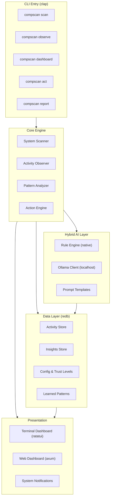
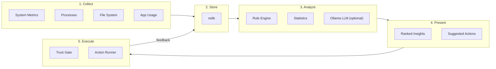
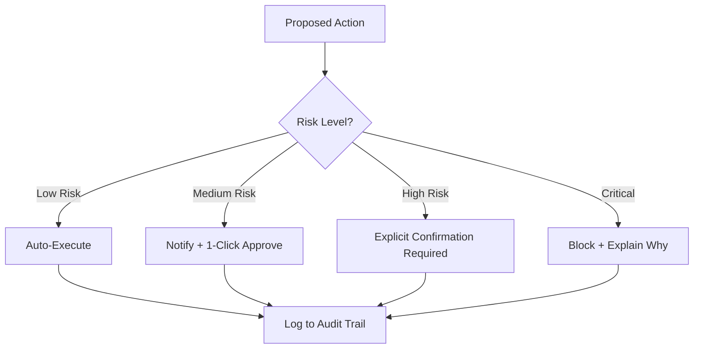

# CompScan Architecture

This document describes the high-level architecture of CompScan: components, data flow, and where to find details in the repo.

---

## Architecture Overview

- **CLI** (`src/cli/`, `src/main.rs`): Single entry point; subcommands dispatch to scanner, observer, analyzer, actions, TUI, or web.
- **Core**: Scanner (system/process/disk/startup/security), Observer (activity/coding/habits), Analyzer (rules + statistics), Action engine (executor + trust gate).
- **AI**: Rule engine (native) + Ollama client for optional LLM reasoning.
- **Storage**: redb database; models in `storage/models.rs`; optional encryption in `storage/encryption.rs`.
- **UI**: TUI (ratatui), Web (axum + embedded SPA), and cross-platform notifications.

---

## Data Flow

1. **Collect**: `compscan scan` and `compscan observe` populate system snapshots and activity records.
2. **Store**: All data written to redb (see `storage/db.rs`, `storage/models.rs`).
3. **Analyze**: `compscan report` runs rules and statistics over stored data to produce insights; Ollama can augment when wired in.
4. **Present**: Insights and suggested actions shown in TUI, web, or report output.
5. **Execute**: `compscan act <id>` runs actions through the trust-level gate and executor; results logged.

---

## Trust-Level Permission System

- **Low risk (auto):** e.g. cache/temp cleanup.
- **Medium risk (notify):** e.g. startup changes, file reorganization.
- **High risk (confirm):** e.g. large file deletion, config changes.
- **Critical (block):** system files, security settings, credentials.

Implementation: `actions/permissions.rs`, `actions/executor.rs`.

---

## Project Structure (source)

| Path | Purpose |
|------|---------|
| `src/main.rs` | Entry point, CLI dispatch, first-run UX |
| `src/cli/mod.rs` | Subcommands: scan, observe, dashboard, web, report, act, status, config |
| `src/scanner/` | System snapshot, processes, filesystem, startup, security |
| `src/observer/` | Activity sampling, coding checks, habits/patterns |
| `src/analyzer/` | Rules, statistics, insight generation and report |
| `src/ai/` | Ollama client, prompts, hybrid reasoning |
| `src/actions/` | Registry, executor, permissions, cleanup, optimization, workflow |
| `src/storage/` | redb DB, models, encryption (optional) |
| `src/ui/tui/` | Ratatui dashboard (Overview, Insights, Actions, History) |
| `src/ui/web/` | Axum server, REST API, embedded HTML/JS |
| `src/ui/notifications.rs` | macOS/Linux/Windows system notifications |
| `src/daemon/` | Status display, scheduler stubs |

---

## Where to Read More

- **User-facing:** [USER_GUIDE.md](USER_GUIDE.md) — install, workflow, benefits.
- **Contributors:** [CONTRIBUTING.md](../CONTRIBUTING.md) — how to contribute.
- **Plan vs implementation:** [PLAN_AUDIT.md](PLAN_AUDIT.md) — gaps and status.
- **Docs index:** [README.md](README.md) (this folder) — list of all documentation.
- **AI/agents:** [AGENTS.md](../AGENTS.md) — for AI contributors.
- **Security:** [SECURITY.md](../SECURITY.md) — reporting and policy.
- **Memory bank:** `memory-bank/` — projectbrief, techContext, systemPatterns, progress, etc., for context across sessions.
